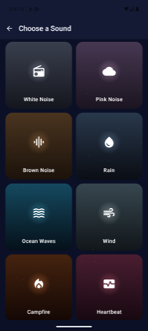
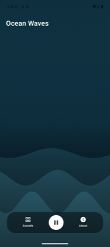
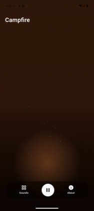
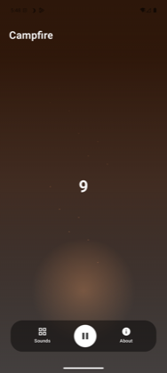
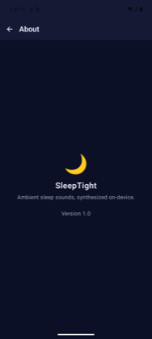

# 🌙 SleepTight

A minimal ambient sound player for falling asleep — pick one sound, drag to set the volume,
and it keeps playing in the background until you stop it.

[](https://github.com/morganbovi/SleepTight/actions/workflows/android-ci.yml)

<p float="left">
  
  
  
  
</p>

## What it does

- **Eight ambient sounds** — White Noise, Pink Noise, Brown Noise, Rain, Ocean Waves, Wind,
  Campfire, and Heartbeat — each **synthesized live on-device**, not played from an audio
  file. No assets to license, no APK bloat, and every loop is seamless because there's no
  loop point to begin with.
- **One sound at a time.** Pick a new one and it replaces whatever's playing — this app is
  deliberately not a mixer.
- **Full-screen generative backgrounds**, one per sound, drawn and animated in Compose to
  match the mood (falling rain streaks, rolling wave curves, rising embers, a pulsing
  heartbeat), instead of stock photography.
- **Drag anywhere to change the volume.** No visible slider — press down and drag up/down,
  and the whole screen fills like rising water to show where the *device* volume (not an
  in-app fake) landed, in plain 0–10 clicks. Works the same whether you're dragging, using
  the hardware volume keys, or another app changed it.
- **Keeps playing after you leave.** A foreground service holds playback (and the selected
  sound survives app restarts), with a notification offering Pause/Resume and Stop.
- **Reopens where you left off.** Last sound picked is remembered; first launch ever (or
  after a full stop) goes straight to the picker instead.

## Building

Requires JDK 21 and the Android SDK (`compileSdk` 36). Gradle will fetch its own toolchain
JDK automatically via the configured toolchain resolver.

```bash
./gradlew assembleDebug     # debug APK
./gradlew bundleRelease     # release App Bundle (unsigned unless configured — see below)
```

Or open the project in Android Studio and run it.

## Release signing

Release builds are unsigned by default so the project builds out of the box. To sign one,
create `keystore.properties` at the repo root (already git-ignored):

```properties
storeFile=/absolute/path/to/release.jks
storePassword=...
keyAlias=...
keyPassword=...
```

The [release workflow](.github/workflows/android-release.yml) picks up the same
configuration from repo secrets (`KEYSTORE_BASE64`, `KEYSTORE_PASSWORD`, `KEY_ALIAS`,
`KEY_PASSWORD`) — set those once and every run produces a signed AAB/APK. Trigger it
manually from the Actions tab, or push a tag like `v1.0.0` to also cut a GitHub Release.

## Architecture

Kotlin + Jetpack Compose, no XML layouts. Each screen is a `Presenter` (owns state, events,
and navigation) plus a matching `UiModel` (the immutable state it hands to the `Screen`
composable) — no `ViewModel` in sight:

```
features/
  player/    PlayerPresenter, PlayerUiModel, PlayerScreen
  picker/    SoundPickerPresenter, SoundPickerUiModel, SoundPickerScreen
  about/     AboutPresenter, AboutUiModel, AboutScreen
audio/       SoundEngine (singleton), SoundVoice (AudioTrack per sound), NoiseGenerators
ui/
  background/  procedural Canvas art + shared color palettes per sound
  icons/       Material icon mapping per sound
  navigation/  tiny ScreenNavigator (this app only has 3 screens)
  presenter/   EventHandler/SingleEventHandler shared by every presenter
service/     PlaybackService (foreground service) + its own presenter
data/        LastSoundRepository (SharedPreferences)
```

<p float="left">
  
</p>
